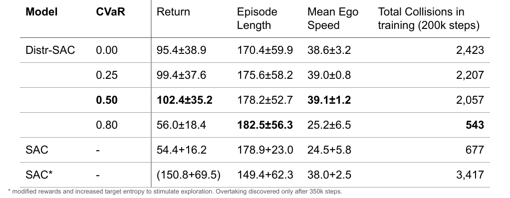

# Highway-RACER

<video src="results/best_policy_highway_eval_checkpoint_190000_episode_4.mp4" width="640" controls></video>

A small research repository that integrates **RACER** (Risk-sensitive Actor Critic with Epistemic Robustness) with a continuous-action `highway-env` to train a distributional Soft Actor-Critic (SAC). The original RACER implementation by Kyle Stachowicz is available at: [https://github.com/kylestach/epistemic-rl-release](https://github.com/kylestach/epistemic-rl-release).

---

## Setup

* Python 3.11 (tested)
* See `requirements.txt` for full dependency list

Create and activate a virtual environment, then install the dependencies:

```bash
python -m venv .venv
source .venv/bin/activate
pip install -r requirements.txt
```

---

## Training

Start training with the included script:

```bash
python -m racer.scripts.train_highway
```

During training you should observe that the **average speed** of the agent reaches approximately **35 m/s** by around **30k steps**.

---

## Evaluation & results

Comparing standard SAC with the RACER distributional SAC shows better performance and faster convergence for the distributional variant:


